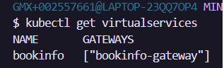
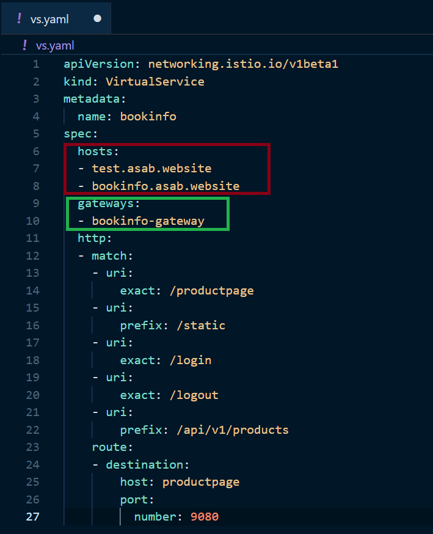
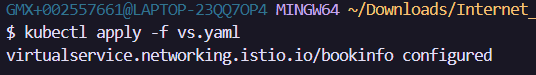
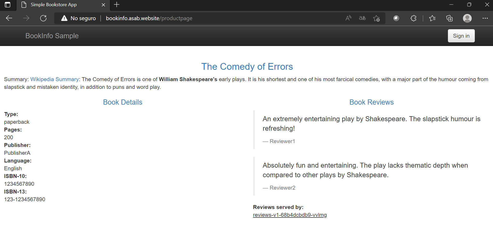
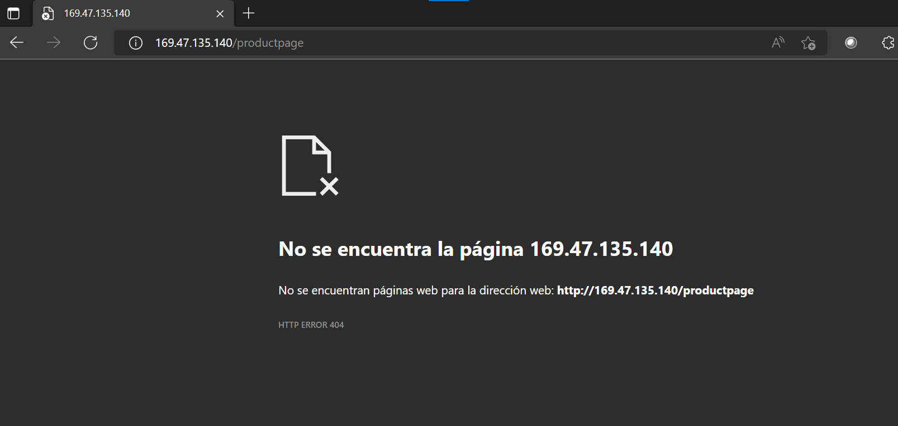

# Kubernetes-Istio-CIS-DestinationRule:shield:

*Istio* es una malla de servicios dedicada a asegurar la comunicación entre microservicios de forma rápida, segura y confiable. Para ello incluye servicios de traffic management, security y observability.

La presente guía esta enfocada en realizar las configuraciones necesarias para gestionar el tráfico de entrada y salida a un Virtual Server de infraestructura clásica para permitir únicamente el tráfico proveniente de *IBM® Cloud Internet Services*. De esta forma se asegura que todas las entradas al Virtual Server pasen por la seguridad proveída por *IBM® Cloud Internet Services*. Para esta configuración se usará el Ingress Gateway de *Istio*. Sin embargo, también es posible realizarlo usando <a href="https://github.com/emeloibmco/IBM-Cloud-Internet-Services-Security-Groups"> *IBM® Cloud Security Groups* </a>


<br />

## Índice  📰
1. [Pre-Requisitos](#Pre-Requisitos-pencil)
2. [Asignación de subdominio](#asignación-de-subdominio)
3. [Aplicación de reglas](#aplicación-de-reglas)
4. [Referencias](#Referencias-mag)
5. [Autores](#Autores-black_nib)
<br />

## Pre-Requisitos :pencil:
* Contar con una instancia de <a href="https://cloud.ibm.com/catalog/services/internet-services"> IBM Cloud Internet Services </a> con un dominio asignado.
* Contar con un servicio de kubernetes desplegado en un servidor de infraestructura clásica.
<br />

## Asignación de subdominio
Ingrese a su instancia de *IBM® Cloud Internet Services* y acceda a la pestaña ```reliability``` y posteriormente a la sección ```DNS```. Dé clic en agregar DNS record y complete la información según corresponda:
* ```Type```: Tipo A para direcciones IP. 
* ```TTL```: Automatic.
* ```Name```: Escriba el subdominio que desea agregar.
* ```IPv4 Address```: Ingrese la dirección IP donde está desplegado su servicio.
</br>

Dé clic en crear y posteriormente active la opción de ```Proxy``` para habilitar el tráfico a través de CIS y aplicar las normas que serán agregadas a los security groups

<br />
<p align="center"></p>
<br />

## Aplicación de reglas

Luego de configurar los subdominios debera configurar el gateway de Istio. Desde la consola podra observar la configuración predeterminada del gateway de Istio.

Para ver los gateways use el siguiente comando:

```
kubectl get gateways
```
<p align="center"></p>
Luego tenga en cuenta el nombre del gateway y ejecute el siguiente comando:

```
kubectl describe gateway <nombre_del_gateway>
```
<p align="center"></p>

Asegurese que el apartado subrayado este como en la imagen.

Despues debera verificar si existen virtual services dentro de istio. El virtual service le permitira gestionar el trafico que entre al service mesh a traves del gateway.

Para verificar si existen virtual services en la malla ejecute:

``` 
kubectl get virtual services
```
<p align="center"></p>

Tenga en cuenta que el apartado de gateways hace referencia sobre que gateway se ejecutara el virtual service.

Para permitir que el trafico unicamente entre por nuestro dominio deberemos copiar el contenido de la virtual service existente en la malla y va editar los siguientes parametros.

<p align="center"></p>

Code snippet:
```YAML
apiVersion: networking.istio.io/v1beta1
kind: VirtualService
metadata:
  name: bookinfo
spec:
  hosts:
  - test.asab.website
  - bookinfo.asab.website
  gateways:
  - bookinfo-gateway
  http:
  - match:
    - uri:
        exact: /productpage
    - uri:
        prefix: /static
    - uri:
        exact: /login
    - uri:
        exact: /logout
    - uri:
        prefix: /api/v1/products
    route:
    - destination:
        host: productpage
        port:
          number: 9080 
```

En el apartado de host debera incluir todos aquellos dominios, subdominios o IPs que tienen permitido enviar trafico a la malla a traves del gateway.

Luego el gateway debera ser el nombre del gateway sobre el cual desea aplicar el virtual service.


Finalmente debera aplicar el virtual service de la siguiente manera:

```
kubectl apply -f <nombre-de-su-yaml.yaml>
```
<p align="center"></p>

Ahora el trafico estara restringido a los subdominios registrados. Si hacemos la prueba podemos observar que el trafico solo es permitido a traves de los subdominios y no la IP del cluster.

<p align="center"></p>

Si intenta acceder con la IP la petición fallara como se muestra a continuación:

<p align="center"></p>


## Referencias :mag:
* <a href="https://istio.io/latest/docs/reference/config/networking/gateway/#Gateway"> Istio Gateway</a>

* <a href="https://cloud.ibm.com/docs/cis?topic=cis-get-started-new-subdomain"> IBM Cloud Internet Services new subdomain</a>


<br />

## Autores :black_nib:
Equipo IBM Cloud Tech Sales Colombia.
<br />