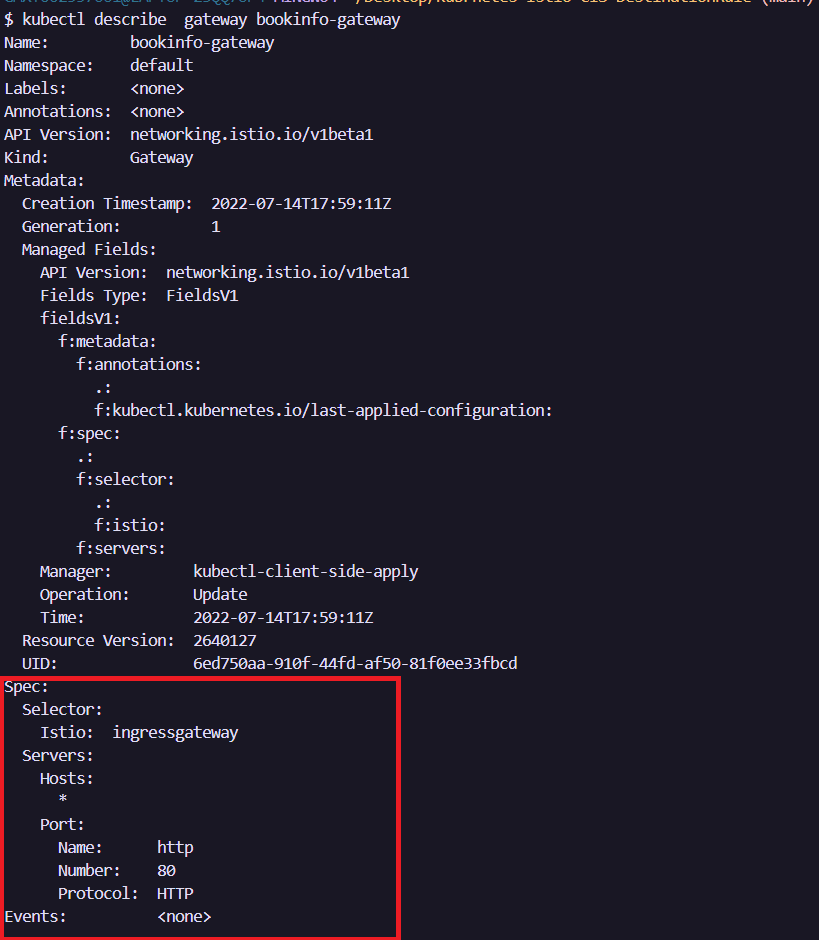

# Kubernetes-Istio-CIS-DestinationRule:shield:

*Istio* es una malla de servicios dedicada a asegurar la comunicación entre microservicios de forma rápida, segura y confiable. Para ello incluye servicios de traffic management, security y observability.

La presente guía esta enfocada en realizar las configuraciones necesarias para gestionar el tráfico de entrada y salida a un Virtual Server de infraestructura clásica para permitir únicamente el tráfico proveniente de *IBM® Cloud Internet Services*. De esta forma se asegura que todas las entradas al Virtual Server pasen por la seguridad proveída por *IBM® Cloud Internet Services*. Para esta configuración se usará el Ingress Gateway de *Istio*. Sin embargo, también es posible realizarlo usando <a href="https://github.com/emeloibmco/IBM-Cloud-Internet-Services-Security-Groups"> *IBM® Cloud Security Groups* </a>


<br />

## Índice  📰
1. [Pre-Requisitos](#Pre-Requisitos-pencil)
2. [Asignación de subdominio](#asignación-de-subdominio)
3. [Aplicación de reglas](#aplicación-de-reglas)
4. [Referencias](#Referencias-mag)
5. [Autores](#Autores-black_nib)
<br />

## Pre-Requisitos :pencil:
* Contar con una instancia de <a href="https://cloud.ibm.com/catalog/services/internet-services"> IBM Cloud Internet Services </a> con un dominio asignado.
* Contar con un servicio de kubernetes desplegado en un servidor de infraestructura clásica.
<br />

## Asignación de subdominio
Ingrese a su instancia de *IBM® Cloud Internet Services* y acceda a la pestaña ```reliability``` y posteriormente a la sección ```DNS```. Dé clic en agregar DNS record y complete la información según corresponda:
* ```Type```: Tipo A para direcciones IP. 
* ```TTL```: Automatic.
* ```Name```: Escriba el subdominio que desea agregar.
* ```IPv4 Address```: Ingrese la dirección IP donde está desplegado su servicio.
</br>

Dé clic en crear y posteriormente active la opción de ```Proxy``` para habilitar el tráfico a través de CIS y aplicar las normas que serán agregadas a los security groups

<br />
<p align="center"></p>
<br />

## Aplicación de reglas

Luego de configurar los subdominios debera configurar el gateway de Istio. Desde la consola podra observar la configuración predeterminada del gateway de Istio.

Para ver los gateways use el siguiente comando:

```
kubectl get gateways
```
<p align="center"></p>
Luego tenga en cuenta el nombre del gateway y ejecute el siguiente comando:

```
kubectl describe gateway <nombre_del_gateway>
```
<p align="center"></p>

Asegurese que el apartado subrayado este como en la imagen.

## Referencias :mag:
* <a href="https://istio.io/latest/docs/reference/config/networking/gateway/#Gateway"> Istio Gateway</a>

* <a href="https://cloud.ibm.com/docs/cis?topic=cis-get-started-new-subdomain"> IBM Cloud Internet Services new subdomain</a>


<br />

## Autores :black_nib:
Equipo IBM Cloud Tech Sales Colombia.
<br />